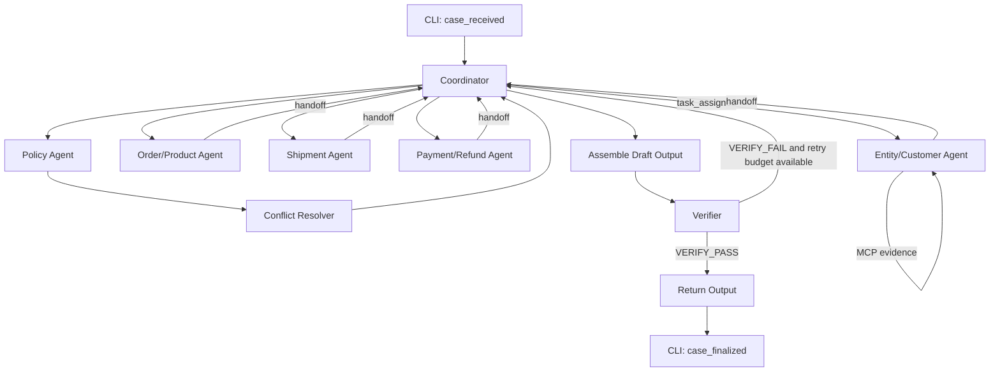

# LAB 09 — Kế hoạch phân chia task chi tiết theo từng thành viên
## K4 L3B — Multi-Agent MCP + A2A

> Mục tiêu của tài liệu này là biến phần phân công trong **Lab 09.docx** thành một kế hoạch triển khai thực tế, đủ chi tiết để mỗi thành viên có thể tạo branch riêng, làm việc tương đối độc lập, commit/PR đúng thứ tự và cuối cùng tích hợp thành một submission hợp lệ.
>
> Tài liệu này được xây dựng sau khi rà soát toàn bộ starter repo `K4-L3B-MultiAgent-MCP-A2A-1`, gồm README, `ARCHITECTURE.md`, public contracts, JSON Schema, scoring policy, CLI, MCP gateway, trace writer, submission packager và các test hiện có.

---

# 1. Bài toán Lab 09 đang yêu cầu gì?

Starter repo hiện tại **chưa có phần giải bài toán chính**. File:

```text
src/student_agent/workflow.py
```

mới chỉ có:

```python
async def solve_case(case, gateway, trace) -> dict:
    ...
    raise NotImplementedError(...)
```

Nhóm phải xây dựng workflow điều tra khiếu nại thương mại điện tử theo mô hình **multi-agent**, sử dụng:

- **MCP** để lấy evidence từ hệ thống;
- **A2A** để thể hiện việc các agent giao việc/handoff cho nhau;
- **Trace** để chứng minh workflow thực tế đã xảy ra;
- **Entity resolution** để xác định đúng order/customer khi input không đầy đủ;
- **Specialist agents** để điều tra order, shipment, payment, refund, policy;
- **Conflict resolver** để xử lý nguồn dữ liệu mâu thuẫn;
- **Verifier** để kiểm tra kết quả trước khi finalize;
- JSON output phải đúng schema `day09-l3b-output-v2`.

Repo không bắt buộc framework agent cụ thể. Vì scorer chấm **output, evidence, provenance, consistency, workflow và efficiency**, nhóm nên ưu tiên code deterministic, dễ test, ít MCP call thừa hơn là cố nhồi thêm framework/LLM không cần thiết.

---

# 2. Những ràng buộc quan trọng rút ra từ starter repo

## 2.1. Python và môi trường

Repo yêu cầu:

```text
Python >= 3.11
```

Có thể dùng `uv` thay cho pip.

Khuyến nghị trên macOS/Linux:

```bash
uv venv --python 3.11
source .venv/bin/activate
uv pip install -e ".[dev]"
```

Kiểm tra:

```bash
pytest -q
day09 --help
```

Nếu dùng pip đúng theo README:

```bash
python3.11 -m venv .venv
source .venv/bin/activate
python -m pip install -e ".[dev]"
```

---

## 2.2. Output bắt buộc của L3B

Mỗi case phải tạo đủ các field chính:

```text
schema_version
case_id
assessment
affected_entities
entity_resolution
customer_context
shipment_analysis
payment_analysis
root_cause_analysis
evidence_refs
data_conflicts
financial_resolution
resolution_actions
```

`claim_assessments` là optional nhưng nên dùng nếu input chứa nhiều claim và nhóm có thể map evidence rõ ràng.

---

## 2.3. Trace event hợp lệ

Public schema chỉ cho phép các event:

```text
case_received
task_assigned
tool_result_consumed
handoff
policy_decided
verification_completed
case_finalized
```

Không tự chế event name khác.

Đặc biệt:

- `case_received` và `case_finalized` đã được `cli.py` emit;
- các agent cần tạo:
  - `task_assigned`;
  - `tool_result_consumed`;
  - `handoff`;
  - `policy_decided` khi policy/conflict agent ra quyết định;
  - `verification_completed` trước finalize.

**Không được ghi prompt bí mật, chain-of-thought hoặc suy luận nội bộ vào trace.**

Chỉ trace sự kiện quan sát được, decision code, tool name, evidence refs và metadata ngắn.

---

## 2.4. Evidence/MCP

MCP response có các field:

```text
schema_version
evidence_ref
result_hash
domain
data
warnings
```

`evidence_ref`:

- do server sinh;
- không được tự tạo;
- không được sửa;
- không được dùng chéo case;
- khi evidence thực sự được sử dụng phải emit `tool_result_consumed`.

Mọi MCP call được audit và có thể ảnh hưởng điểm efficiency.

---

## 2.5. Điểm L3B

Ưu tiên triển khai theo trọng số:

| Thành phần | Trọng số |
|---|---:|
| Semantic correctness | 40% |
| Evidence quality | 15% |
| Evidence provenance | 15% |
| Cross-field consistency | 10% |
| JSON Schema | 5% |
| Confidence calibration | 5% |
| Workflow/trace | 5% |
| MCP efficiency | 5% |

Hard gate nguy hiểm nhất:

- sai `case_id`;
- schema không thể chấm;
- thiếu evidence bắt buộc;
- evidence ref không tồn tại;
- evidence ref sai team/run/case.

---

# 3. Phân công chính thức của nhóm

| Thành viên | Vai trò | Phần sở hữu chính |
|---|---|---|
| **Lê Minh Sang** | Team Lead / Coordinator & Infrastructure | Coordinator, workflow, A2A protocol, trace orchestration, integration, `ARCHITECTURE.md` |
| **Nguyễn Tiến Phát** | Entity Resolution & Customer Expert | Entity/customer agent, candidate ranking, fuzzy matching, customer context |
| **Nguyễn Đình Lâm Phúc** | Order, Product & Shipment Specialist | Order/product agent, shipment agent, order/item/seller/shipment evidence |
| **Hoàng** | Payment & Refund Specialist | Payment/refund agent, reconciliation, refund consistency |
| **Nguyễn Văn Hồng** | Policy Expert & Conflict Resolver | Policy agent, source conflicts, responsibility, policy-based decisions |
| **Hồ Thái Hòa** | Verifier, QA & Optimization | Verifier agent, invariants, caching/retry review, full validation, packaging |

---

# 4. Cấu trúc code đề xuất để giảm xung đột Git

Starter hiện chỉ có một `workflow.py`. Nếu cả 6 người cùng sửa file này thì gần như chắc chắn conflict.

Nên tách thành:

```text
src/student_agent/
├── __init__.py
├── a2a.py                       # Sang
├── agent_types.py               # Sang
├── evidence_cache.py            # Hòa
├── cases.py                     # starter - hạn chế sửa
├── cli.py                       # starter - hạn chế sửa
├── config.py                    # starter - hạn chế sửa
├── contracts.py                 # starter - hạn chế sửa
├── mcp_gateway.py               # starter - chỉ sửa khi thật cần
├── submission.py                # starter - không sửa nếu không cần
├── trace.py                     # starter - hạn chế sửa
├── workflow.py                  # Sang - coordinator/integration
└── agents/
    ├── __init__.py
    ├── entity_customer.py       # Phát
    ├── order_product.py         # Phúc
    ├── shipment.py              # Phúc
    ├── payment_refund.py        # Hoàng
    ├── policy.py                # Hồng
    ├── conflict_resolver.py     # Hồng
    └── verifier.py              # Hòa

tests/
├── test_starter.py              # starter
├── test_release_safety.py       # starter
├── test_entity_customer.py      # Phát
├── test_order_product.py        # Phúc
├── test_shipment.py             # Phúc
├── test_payment_refund.py       # Hoàng
├── test_policy_conflict.py      # Hồng
├── test_verifier.py             # Hòa
└── test_workflow_integration.py # Sang + Hòa
```

## Quy tắc ownership

Mỗi người chỉ nên sửa file của mình.

Nếu buộc phải sửa file người khác:

1. báo trước trong nhóm;
2. tạo commit riêng;
3. không trộn refactor ngoài phạm vi;
4. owner của file phải review PR.

---

# 5. A2A contract phải thống nhất trước khi mọi người code

Đây là dependency quan trọng nhất.

Sang cần merge A2A contract vào `develop` trước để các agent cùng trả về một shape thống nhất.

Đề xuất `agent_types.py`:

```python
from dataclasses import dataclass, field
from typing import Any


@dataclass
class AgentResult:
    case_id: str
    actor: str
    status: str
    confidence: float
    data: dict[str, Any] = field(default_factory=dict)
    evidence_refs: list[str] = field(default_factory=list)
    warnings: list[str] = field(default_factory=list)
    decision_code: str | None = None
```

Status chỉ nên dùng nội bộ:

```text
ok
ambiguous
insufficient_evidence
needs_followup
error
```

Đề xuất message/handoff envelope trong `a2a.py`:

```python
{
    "case_id": "...",
    "task_id": "...",
    "from_actor": "coordinator",
    "to_actor": "entity-agent",
    "task_type": "resolve_entity",
    "payload": {...},
    "evidence_refs": [...],
}
```

## Nguyên tắc

- `case_id` luôn bắt buộc.
- Evidence của case A tuyệt đối không xuất hiện trong case B.
- Agent không trả chain-of-thought.
- Agent chỉ trả:
  - kết quả;
  - confidence;
  - evidence;
  - warning;
  - decision code.
- Không truyền object quá lớn giữa agents nếu chỉ cần ID/evidence ref.
- Không tạo vòng lặp agent vô hạn.
- Coordinator là người quyết định agent nào cần chạy tiếp.

---

# 6. Git workflow toàn nhóm

## 6.1. Branch chính

Đề xuất:

```text
main       -> bản ổn định, chỉ merge khi đã pass QA
develop    -> branch tích hợp chung
feature/*  -> branch của từng thành viên
```

Sang tạo `develop`:

```bash
git checkout main
git pull origin main

git checkout -b develop
git push -u origin develop
```

Sau đó tất cả thành viên branch từ `develop`, **không branch từ main** sau khi scaffold đã merge.

---

## 6.2. Tên branch

```text
feature/sang-coordinator-infra
feature/phat-entity-customer
feature/phuc-order-shipment
feature/hoang-payment-refund
feature/hong-policy-conflict
feature/hoa-verifier-qa
```

Nếu một người cần làm task nhỏ riêng:

```text
fix/hoa-cache-key
fix/sang-trace-handoff
test/phuc-shipment-edge-cases
docs/sang-architecture
```

---

## 6.3. Cách tạo branch chuẩn

Ví dụ Phát:

```bash
git checkout develop
git pull origin develop

git checkout -b feature/phat-entity-customer
git push -u origin feature/phat-entity-customer
```

Các thành viên khác làm tương tự.

---

## 6.4. Trước khi bắt đầu phiên làm việc

```bash
git checkout develop
git pull origin develop

git checkout feature/<ten-branch>
git rebase develop
```

Nếu branch đã push và rebase làm thay đổi history:

```bash
git push --force-with-lease
```

**Không dùng `git push --force` thường.**

---

## 6.5. Trước khi mở PR

```bash
ruff check .
pytest -q
```

Nếu đã có input và `.env`:

```bash
day09 validate-inputs
day09 mcp-tools
```

Sau đó:

```bash
git status
git add <các-file-thực-sự-liên-quan>
git commit -m "feat(entity): implement candidate resolution"
git push
```

PR target:

```text
feature/...  -> develop
```

Không merge trực tiếp vào `main`.

---

# 7. Thứ tự triển khai toàn dự án

## Phase 0 — Setup đồng thời

Tất cả 6 người có thể làm song song:

```bash
git clone <repo-url>
cd K4-L3B-MultiAgent-MCP-A2A-1

uv venv --python 3.11
source .venv/bin/activate
uv pip install -e ".[dev]"

pytest -q
day09 --help
```

Tạo `.env`:

```bash
cp .env.example .env
```

Điền key thật nhưng:

```text
KHÔNG commit .env
KHÔNG paste key vào source
KHÔNG paste key vào trace/output
```

---

## Phase 1 — Sang phải đi trước một bước

Sang tạo và merge:

1. `develop`;
2. `agents/`;
3. `agent_types.py`;
4. `a2a.py`;
5. interface/hàm stub của từng specialist;
6. convention actor names;
7. convention decision codes;
8. skeleton integration test.

Sau khi PR scaffold merge vào `develop`, cả nhóm rebase/pull và bắt đầu code specialist.

Đây là dependency bắt buộc.

---

## Phase 2 — Các specialist làm song song

Có thể chạy đồng thời:

```text
Phát  -> Entity + Customer
Phúc  -> Order/Product + Shipment
Hoàng -> Payment + Refund
Hồng  -> Policy + Conflict
Hòa   -> Verifier skeleton + QA helpers + cache design
Sang  -> Coordinator orchestration + ARCHITECTURE skeleton
```

---

## Phase 3 — Merge specialist

Khuyến nghị merge theo thứ tự:

```text
1. Phát
2. Phúc
3. Hoàng
4. Hồng
5. Sang cập nhật coordinator integration
6. Hòa merge verifier/QA final
```

Lý do:

- Entity resolution quyết định order/customer scope cho các bước sau.
- Order/shipment và payment có thể điều tra song song sau khi entity được resolve.
- Policy/conflict cần đọc kết quả các specialist.
- Verifier nên là chốt cuối.

Các PR 2–4 có thể review/merge rất gần nhau nếu interface đã ổn định.

---

## Phase 4 — Integration

Sang tích hợp toàn flow:

```text
Input
  ↓
Entity/Customer
  ↓
Coordinator
  ├── Order/Product
  ├── Shipment
  └── Payment/Refund
          ↓
      Policy
          ↓
  Conflict Resolver
          ↓
       Verifier
          ↓
        Output
```

Order/shipment/payment có thể chạy độc lập về logic. Nếu nhóm muốn dùng `asyncio.gather`, chỉ dùng sau khi chắc chắn gateway/client cho phép concurrency ổn định.

Ưu tiên correctness trước concurrency.

---

## Phase 5 — QA / package

Hòa chạy full suite.

Nếu fail:

```text
schema fail       -> trả owner field tương ứng
evidence fail     -> specialist owner
trace fail        -> Sang
consistency fail  -> Hồng + Hòa + owner domain
efficiency fail   -> Hòa + specialist owner
integration fail  -> Sang
```

---

# 8. Task chi tiết — Lê Minh Sang
## Team Lead / Coordinator & Infrastructure

## Branch

```bash
git checkout develop
git pull origin develop
git checkout -b feature/sang-coordinator-infra
git push -u origin feature/sang-coordinator-infra
```

---

## Giai đoạn Sang-1 — Khóa kiến trúc và interface

### File tạo/sửa

```text
src/student_agent/agent_types.py
src/student_agent/a2a.py
src/student_agent/agents/__init__.py
src/student_agent/workflow.py
tests/test_workflow_integration.py
ARCHITECTURE.md
```

### Việc phải làm

1. Chốt actor name:

```text
coordinator
entity-agent
order-product-agent
shipment-agent
payment-refund-agent
policy-agent
conflict-resolver
verifier
```

2. Chốt `AgentResult`.

3. Chốt input/output của từng agent.

Ví dụ:

```python
async def run_entity_customer_agent(...) -> AgentResult
async def run_order_product_agent(...) -> AgentResult
async def run_shipment_agent(...) -> AgentResult
async def run_payment_refund_agent(...) -> AgentResult
async def run_policy_agent(...) -> AgentResult
def resolve_conflicts(...) -> AgentResult
def verify_output(...) -> AgentResult
```

4. Không implement nghiệp vụ của người khác ở giai đoạn này.

5. Tạo stub đủ để specialist có thể branch và code độc lập.

---

## Giai đoạn Sang-2 — Thiết kế Coordinator state

Trong `workflow.py`, coordinator cần có state per-case, ví dụ:

```python
state = {
    "case_id": case["case_id"],
    "input": case,
    "entity": None,
    "order": None,
    "shipment": None,
    "payment": None,
    "policy": None,
    "conflicts": None,
    "verification": None,
    "evidence_refs": [],
}
```

Không dùng global evidence cache dùng chung nhiều case.

---

## Giai đoạn Sang-3 — Emit workflow trace

Coordinator cần emit:

### Khi giao việc

```python
trace.emit(
    case_id=case_id,
    event_type="task_assigned",
    actor="coordinator",
    target="entity-agent",
    decision_code="RESOLVE_ENTITY",
)
```

### Sau khi agent xong

```python
trace.emit(
    case_id=case_id,
    event_type="handoff",
    actor="entity-agent",
    target="coordinator",
    decision_code="ENTITY_RESOLVED",
    evidence_refs=result.evidence_refs,
)
```

### Quy tắc

- Không emit text reasoning.
- Không nhét raw customer data vào `attributes`.
- Không nhét API key.
- `attributes` chỉ chứa metric/flag ngắn:

```python
attributes={
    "candidate_count": 3,
    "resolved_count": 1,
    "confidence": 0.93,
}
```

---

## Giai đoạn Sang-4 — Điều phối dependency

Pseudo-flow:

```python
entity = await run_entity_customer_agent(...)

if entity.status == "not_found":
    # Không được invent order.
    # Chuyển sang output insufficient evidence / needs investigation.
    ...
else:
    order = await run_order_product_agent(...)
    shipment = await run_shipment_agent(...)
    payment = await run_payment_refund_agent(...)

    policy = await run_policy_agent(...)
    conflicts = resolve_conflicts(...)

    draft = assemble_output(...)
    verification = verify_output(draft, ...)
```

Nếu entity ambiguous:

- không tùy tiện chọn candidate thấp confidence;
- có thể điều tra thêm bằng evidence;
- nếu vẫn ambiguous thì output phải phản ánh `entity_resolution.status="ambiguous"`.

---

## Giai đoạn Sang-5 — Assemble final output

Sang chịu trách nhiệm đảm bảo output cuối đủ mọi field.

Khung:

```python
output = {
    "schema_version": "day09-l3b-output-v2",
    "case_id": case_id,
    "assessment": {...},
    "affected_entities": {...},
    "entity_resolution": {...},
    "customer_context": {...},
    "shipment_analysis": {...},
    "payment_analysis": {...},
    "root_cause_analysis": {...},
    "evidence_refs": [...],
    "data_conflicts": [...],
    "financial_resolution": {...},
    "resolution_actions": [...],
}
```

`evidence_refs` global phải dedupe nhưng giữ evidence thực sự đã dùng.

Không đưa evidence "cho đủ số".

---

## Giai đoạn Sang-6 — ARCHITECTURE.md

Hoàn thiện đủ 7 phần starter yêu cầu:

1. System overview.
2. Agent ownership.
3. Entity resolution và A2A protocol.
4. Evidence/conflict lifecycle.
5. Failure and efficiency policy.
6. Verification invariants.
7. Reproducibility.

Đặc biệt mô tả:

- timeout/retry budget;
- cache scope per case;
- confidence threshold;
- rejected candidates;
- source precedence;
- no cross-case evidence;
- lệnh chạy;
- không ghi API key.

---

## Commit đề xuất cho Sang

```text
chore(arch): scaffold agent modules and shared result contract
feat(a2a): define agent handoff protocol
feat(workflow): orchestrate specialist agents
feat(trace): add observable assignment and handoff events
feat(workflow): assemble l3b output from specialist results
test(workflow): add coordinator integration tests
docs(architecture): document multi-agent workflow and invariants
```

## PR

```text
feat: coordinator workflow, A2A protocol and infrastructure
```

---

# 9. Task chi tiết — Nguyễn Tiến Phát
## Entity Resolution & Customer Expert

## Branch

Chỉ tạo sau khi Sang merge scaffold:

```bash
git checkout develop
git pull origin develop
git checkout -b feature/phat-entity-customer
git push -u origin feature/phat-entity-customer
```

## File sở hữu

```text
src/student_agent/agents/entity_customer.py
tests/test_entity_customer.py
```

Nếu cần utility fuzzy nhỏ, đặt trong cùng file trước. Chỉ tách file mới khi thật cần.

---

## Giai đoạn Phát-1 — Hiểu input entity

Đọc input case thật sau khi tải case set.

Cần xác định các tín hiệu có thể dùng:

```text
candidate order IDs
customer identifiers
email/name/address/phone nếu có
item/product hint
purchase date
payment amount
shipment hint
claim content
```

Không assume tất cả case có exact `order_id`.

---

## Giai đoạn Phát-2 — MCP discovery

Chạy:

```bash
day09 mcp-tools
```

Ghi lại **tên tool thực tế** liên quan:

```text
customer
order lookup
customer history
candidate lookup
```

Không đoán tool name ngoài những gì server expose.

Nếu tool có output không đủ:

- báo coordinator qua result status;
- không tự tạo field giả.

---

## Giai đoạn Phát-3 — Candidate ranking

Xây candidate scoring deterministic.

Ví dụ các feature:

```text
exact order hint match
customer ID match
date proximity
amount match
product/item match
address/name similarity
shipment clue match
```

Đề xuất trả:

```python
{
    "candidate_id": "...",
    "score": 0.91,
    "matched_signals": ["amount", "date", "product"],
}
```

Không cần trace toàn bộ scoring internals.

---

## Giai đoạn Phát-4 — Fuzzy matching

Nếu có text sai lệch:

- normalize lowercase;
- strip spaces dư;
- Unicode normalize;
- normalize punctuation;
- có thể dùng `difflib.SequenceMatcher` để tránh thêm dependency.

Ví dụ:

```python
from difflib import SequenceMatcher

def similarity(a: str, b: str) -> float:
    return SequenceMatcher(None, normalize(a), normalize(b)).ratio()
```

Không dùng fuzzy match làm bằng chứng duy nhất cho một quyết định tài chính mạnh.

---

## Giai đoạn Phát-5 — Resolution policy

Đề xuất logic:

```text
top score >= high threshold
AND gap(top1, top2) đủ lớn
    -> resolved

top score có tín hiệu nhưng gap nhỏ
    -> ambiguous

không candidate đủ bằng chứng
    -> not_found
```

Threshold phải được ghi trong `ARCHITECTURE.md` sau khi nhóm test dữ liệu thật.

Không hardcode threshold "đẹp" mà chưa test.

---

## Giai đoạn Phát-6 — Customer context

Sau khi xác định customer:

- gọi tool customer history nếu cần;
- lấy `customer_unique_id`;
- lấy `related_order_ids`;
- chỉ giữ order thực sự liên quan;
- không biến customer history thành "quét tất cả" gây tốn call.

Kết quả phải đủ để Sang map:

```python
data={
    "entity_resolution": {
        "status": "resolved",
        "resolved_order_ids": [...],
        "rejected_candidates": [...],
        "confidence": 0.94,
    },
    "customer_context": {
        "customer_unique_id": "...",
        "related_order_ids": [...],
    },
}
```

---

## Giai đoạn Phát-7 — Evidence trace

Mỗi MCP result thực sự dùng:

```python
trace.emit(
    case_id=case_id,
    event_type="tool_result_consumed",
    actor="entity-agent",
    tool_name=actual_tool_name,
    evidence_refs=[evidence_ref],
)
```

Không emit evidence chưa dùng.

---

## Test Phát phải viết

### Case 1

```text
một candidate exact match -> resolved
```

### Case 2

```text
hai candidate gần bằng nhau -> ambiguous
```

### Case 3

```text
không candidate hợp lý -> not_found
```

### Case 4

```text
fuzzy name nhưng amount/date support -> resolve được
```

### Case 5

```text
candidate bị reject phải nằm trong rejected_candidates
```

### Case 6

```text
không dùng evidence của case khác
```

---

## Done criteria của Phát

- [ ] Không invent order/customer ID.
- [ ] Có `resolved_order_ids`.
- [ ] Có `rejected_candidates`.
- [ ] Có confidence.
- [ ] Có `customer_unique_id` hoặc `null`.
- [ ] Có `related_order_ids`.
- [ ] Evidence refs hợp lệ.
- [ ] Trace đúng actor.
- [ ] Test pass.
- [ ] Ruff pass.

---

## Commit đề xuất

```text
feat(entity): implement candidate normalization and ranking
feat(entity): resolve order and customer context from mcp evidence
feat(entity): add ambiguous and not-found handling
test(entity): cover candidate ranking and fuzzy matching
```

## PR

```text
feat: entity resolution and customer context agent
```

---

# 10. Task chi tiết — Nguyễn Đình Lâm Phúc
## Order, Product & Shipment Specialist

## Branch

```bash
git checkout develop
git pull origin develop
git checkout -b feature/phuc-order-shipment
git push -u origin feature/phuc-order-shipment
```

## File sở hữu

```text
src/student_agent/agents/order_product.py
src/student_agent/agents/shipment.py
tests/test_order_product.py
tests/test_shipment.py
```

---

## Giai đoạn Phúc-1 — Input từ Entity Agent

Phúc không tự resolve lại customer nếu Phát đã làm.

Input tối thiểu từ coordinator:

```text
case_id
resolved_order_ids
customer_unique_id
claim hints
existing evidence_refs
```

Nếu entity unresolved:

- trả `insufficient_evidence`;
- không gọi hàng loạt tool để mò toàn database.

---

## Giai đoạn Phúc-2 — Order/Product Agent

Mục tiêu lấy:

```text
order status
item IDs
seller IDs
product IDs/details
price/freight nếu evidence có
cancellation/unavailability clues
```

Output contribution:

```python
data={
    "order_ids": [...],
    "item_ids": [...],
    "seller_ids": [...],
    "order_statuses": {...},
    "product_facts": [...],
    "root_cause_hints": [...],
}
```

Lưu ý: final schema không có `product_facts`; đây là internal result cho coordinator.

---

## Giai đoạn Phúc-3 — Shipment Agent

Cần phân tích timeline:

```text
order created
approved
seller handoff
carrier pickup
estimated delivery
actual delivery
return/lost event
```

Map về verdict hợp lệ:

```text
on_time
seller_delay
logistics_delay
lost
returned
conflicting
insufficient_evidence
```

Kèm:

```text
late_seller_ids
timeline_complete
shipment_ids
```

---

## Giai đoạn Phúc-4 — Phân biệt seller delay và logistics delay

Không dùng một field duy nhất.

Ví dụ nguyên tắc:

### Seller delay

Nếu evidence cho thấy:

```text
seller handoff xảy ra trễ hơn deadline/hứa hẹn
```

thì seller có khả năng chịu trách nhiệm.

### Logistics delay

Nếu:

```text
seller bàn giao đúng hạn
nhưng carrier transit/delivery bị trễ
```

thì logistics provider có khả năng chịu trách nhiệm.

### Insufficient evidence

Nếu thiếu mốc thời gian quan trọng:

```text
timeline_complete = false
verdict = insufficient_evidence
```

trừ khi evidence khác đủ mạnh.

---

## Giai đoạn Phúc-5 — Source conflict

Nếu order system nói delivered nhưng shipment scan khác:

Phúc **không tự chốt conflict cuối cùng**.

Trả structured facts:

```python
data={
    "shipment_analysis": {...},
    "conflict_candidates": [
        {
            "field": "delivery_status",
            "sources": ["order", "shipment"],
            "values": [...],
        }
    ],
}
```

Hồng sẽ resolve.

---

## Giai đoạn Phúc-6 — Efficiency

Không gọi cùng một tool nhiều lần cho cùng:

```text
(case_id, order_id, domain)
```

Nếu order-product và shipment cần cùng order evidence:

- coordinator/cache nên tái sử dụng;
- hoặc Phúc truyền evidence/data giữa hai agent.

Không quét tất cả order/customer history nếu đã có resolved ID.

---

## Test Phúc phải viết

- [ ] order cancelled + payment exists -> expose canceled fact.
- [ ] seller handoff late -> `seller_delay`.
- [ ] seller on-time, carrier late -> `logistics_delay`.
- [ ] lost shipment -> `lost`.
- [ ] return flow -> `returned`.
- [ ] contradictory statuses -> conflict candidate.
- [ ] missing timeline -> `timeline_complete=false`.
- [ ] all affected item/seller/shipment IDs deduplicated.

---

## Commit đề xuất

```text
feat(order): add order and product evidence analysis
feat(shipment): implement shipment timeline classification
feat(shipment): surface shipment source conflicts
test(order): cover item seller and status extraction
test(shipment): cover delay lost return and incomplete timeline
```

## PR

```text
feat: order product and shipment specialist agents
```

---

# 11. Task chi tiết — Hoàng
## Payment & Refund Specialist

## Branch

```bash
git checkout develop
git pull origin develop
git checkout -b feature/hoang-payment-refund
git push -u origin feature/hoang-payment-refund
```

## File sở hữu

```text
src/student_agent/agents/payment_refund.py
tests/test_payment_refund.py
```

---

## Giai đoạn Hoàng-1 — Xác định payment scope

Input:

```text
case_id
resolved_order_ids
customer context nếu cần
order/item totals nếu đã có
```

Không dùng payment của order khác.

---

## Giai đoạn Hoàng-2 — Reconcile capture

Cần tính:

```text
captured_total_brl
refunded_total_brl
refundable_total_brl
```

Map verdict:

```text
reconciled
capture_mismatch
duplicate_capture
refund_pending
refund_failed
refunded
insufficient_evidence
```

---

## Giai đoạn Hoàng-3 — Multiple payment/split payment

Không assume nhiều payment record = duplicate.

Một case có thể là split payment hợp lệ.

Cần kiểm tra:

```text
sum(captures)
invoice/order expected total
payment reference uniqueness
payment method split
duplicate transaction/reference
```

Nếu tổng thanh toán hợp lệ nhưng chia nhiều source:

```text
payment_analysis.verdict = reconciled
```

và coordinator có thể map issue thành:

```text
valid_split_payment
```

---

## Giai đoạn Hoàng-4 — Duplicate charge

Chỉ kết luận duplicate khi evidence đủ mạnh.

Ví dụ:

```text
same logical charge
same order
unexpected extra capture
not explained by split payment
```

Không dùng chỉ số lượng transaction để kết luận.

---

## Giai đoạn Hoàng-5 — Refund

Cần kiểm tra:

```text
refund initiated?
refund amount?
refund completed?
refund failed?
refund pending?
already refunded?
```

`refundable_total_brl` phải phản ánh amount còn có thể cần hoàn, không đơn giản copy captured total trong mọi case.

---

## Giai đoạn Hoàng-6 — Financial resolution proposal

Hoàng nên trả internal proposal:

```python
data={
    "payment_analysis": {...},
    "payment_references": [...],
    "refund_proposal": {
        "recommended_refund_brl": 0.0,
        "refund_lines": [...]
    },
    "conflict_candidates": [...],
}
```

Final `financial_resolution` do coordinator assemble sau policy/conflict check.

---

## Giai đoạn Hoàng-7 — Numeric safety

Nên normalize amount cẩn thận.

Nếu dùng float vì schema yêu cầu number, tránh phép so sánh trực tiếp kiểu:

```python
captured == expected
```

Nên dùng tolerance:

```python
abs(captured - expected) <= 0.01
```

hoặc Decimal nội bộ rồi convert cuối.

---

## Test Hoàng phải viết

- [ ] payment normal -> reconciled.
- [ ] split payment hợp lệ -> không báo duplicate.
- [ ] duplicated capture -> duplicate_capture.
- [ ] total capture sai -> capture_mismatch.
- [ ] refund đang chờ -> refund_pending.
- [ ] refund fail -> refund_failed.
- [ ] refund hoàn tất -> refunded.
- [ ] missing payment evidence -> insufficient_evidence.
- [ ] amount không âm.
- [ ] payment refs dedupe.

---

## Commit đề xuất

```text
feat(payment): reconcile captures and split payments
feat(refund): analyze refund status and refundable totals
feat(payment): detect duplicate charge and mismatched captures
test(payment): cover capture and refund edge cases
```

## PR

```text
feat: payment and refund specialist agent
```

---

# 12. Task chi tiết — Nguyễn Văn Hồng
## Policy Expert & Conflict Resolver

## Branch

```bash
git checkout develop
git pull origin develop
git checkout -b feature/hong-policy-conflict
git push -u origin feature/hong-policy-conflict
```

## File sở hữu

```text
src/student_agent/agents/policy.py
src/student_agent/agents/conflict_resolver.py
tests/test_policy_conflict.py
```

---

## Giai đoạn Hồng-1 — Policy Agent

Nhận từ coordinator:

```text
case
entity result
order/shipment result
payment/refund result
conflict candidates
```

Gọi MCP policy tools **chỉ khi policy thực sự cần cho claim**.

Không gọi tất cả policy documents cho mọi case.

---

## Giai đoạn Hồng-2 — Policy output

Trả:

```python
data={
    "policy_decisions": [...],
    "responsibility_hints": [...],
    "allowed_actions": [...],
    "forbidden_actions": [...],
}
```

Khi policy được dùng:

```python
trace.emit(
    case_id=case_id,
    event_type="policy_decided",
    actor="policy-agent",
    decision_code="POLICY_REFUND_ELIGIBLE",
    evidence_refs=[policy_evidence_ref],
)
```

---

## Giai đoạn Hồng-3 — Conflict Resolver

Input conflict candidate từ:

```text
Entity
Order
Shipment
Payment
Refund
Policy
```

Final schema cần:

```python
{
    "field": "...",
    "sources": ["...", "..."],
    "selected_source": "...",
    "resolution_code": "..."
}
```

Nếu không thể resolve:

```text
selected_source = null
resolution_code = "UNRESOLVED_INSUFFICIENT_EVIDENCE"
```

Không bắt buộc mọi conflict phải chọn một bên.

---

## Giai đoạn Hồng-4 — Source precedence

Nhóm phải thống nhất precedence theo từng loại field, không dùng một precedence cho mọi domain.

Ví dụ tư duy:

```text
delivery event -> shipment/logistics event mạnh hơn mô tả customer
payment status -> payment/refund ledger mạnh hơn claim text
policy rule -> policy evidence mạnh hơn suy đoán từ order status
identity -> entity/customer evidence mạnh hơn free-text hint
```

Đây chỉ là nguyên tắc; cần calibrate theo tool/data thật.

---

## Giai đoạn Hồng-5 — Root cause

Trả cho coordinator:

```python
{
    "ranked_causes": [
        {"cause_code": "SELLER_LATE_HANDOFF", "rank": 1}
    ],
    "responsible_parties": [
        {"party_type": "seller", "party_id": "..."}
    ]
}
```

`cause_code` phải uppercase và khớp regex:

```text
^[A-Z][A-Z0-9_]{2,79}$
```

---

## Giai đoạn Hồng-6 — Action consistency

Policy/conflict resolver phải kiểm tra:

```text
no_action -> không được đề xuất refund vô lý
refunded -> không đề xuất refund lần nữa
unsupported_claim -> thường không action tài chính nếu không evidence khác
seller responsibility -> responsible_party phải khớp seller
logistics delay -> không gán seller nếu evidence không support
```

---

## Test Hồng phải viết

- [ ] delivered system vs customer claim.
- [ ] payment ledger vs customer claim.
- [ ] conflict resolve được.
- [ ] conflict không resolve được -> selected_source null.
- [ ] seller delay -> seller responsibility.
- [ ] logistics delay -> logistics responsibility.
- [ ] policy không đủ evidence -> không tự tạo action.
- [ ] `resolution_code` không rỗng.

---

## Commit đề xuất

```text
feat(policy): add policy evidence evaluation
feat(conflict): resolve cross-source data conflicts
feat(policy): derive responsibility and allowed actions
test(policy): cover conflict precedence and unresolved cases
```

## PR

```text
feat: policy agent and conflict resolver
```

---

# 13. Task chi tiết — Hồ Thái Hòa
## Verifier, QA & Optimization

## Branch

```bash
git checkout develop
git pull origin develop
git checkout -b feature/hoa-verifier-qa
git push -u origin feature/hoa-verifier-qa
```

## File sở hữu

```text
src/student_agent/agents/verifier.py
src/student_agent/evidence_cache.py
tests/test_verifier.py
tests/test_workflow_integration.py   # phối hợp với Sang
```

---

## Giai đoạn Hòa-1 — Verifier skeleton

Verifier không nên sửa output "âm thầm" quá nhiều.

Tốt nhất trả:

```python
{
    "valid": True/False,
    "errors": [...],
    "warnings": [...],
}
```

Coordinator quyết định:

```text
finalize
hoặc
retry một bước có giới hạn
hoặc
mark needs_investigation
```

---

## Giai đoạn Hòa-2 — Schema validation

Có thể dùng public `Contracts`:

```python
contracts.validate_output(output, "candidate output")
```

Nếu không truyền `Contracts` vào verifier, viết structural checks đơn giản và để CLI validate sau.

Không copy nguyên schema sang code nếu không cần.

---

## Giai đoạn Hòa-3 — Verification invariants

Ít nhất kiểm tra:

### Identity

```text
output.case_id == input.case_id
```

### Entity

```text
resolved và rejected không overlap
resolved order phải nằm trong affected order
không dùng customer/order ngoài scope
```

### Evidence

```text
evidence refs dedupe
evidence refs đã consumed
không reuse giữa case
```

### Shipment

```text
seller_delay -> late_seller_ids không được vô lý
timeline_complete false cần giảm confidence nếu thiếu mốc quan trọng
```

### Payment

```text
captured_total_brl >= 0
refunded_total_brl >= 0
refundable_total_brl >= 0
recommended refund không mâu thuẫn payment/refund state
```

### Consistency

```text
case_status=no_action nhưng resolution_actions lại "refund now" -> lỗi
already refunded nhưng recommended_refund > 0 -> lỗi
duplicate action strings -> lỗi
responsible party không khớp root cause -> warning/error
```

### Confidence

```text
0 <= confidence <= 1
ambiguous/not_found mà confidence quá cao -> warning
insufficient evidence mà confidence 1.0 -> warning
```

---

## Giai đoạn Hòa-4 — Evidence cache

Cache phải **per case**, không global cross-case.

Đề xuất key:

```python
(case_id, tool_name, normalized_arguments)
```

Ví dụ:

```python
class CaseEvidenceCache:
    def __init__(self, case_id: str):
        self.case_id = case_id
        self._values = {}
```

Tuyệt đối không key chỉ bằng:

```text
order_id
```

vì dễ reuse sai scope.

---

## Giai đoạn Hòa-5 — Retry policy

Chỉ retry lỗi transient.

Ví dụ:

```text
timeout
temporary transport error
```

Không retry:

```text
invalid argument
not found deterministic
schema invalid
permission error
```

Retry budget gợi ý ban đầu:

```text
max 1 retry/tool call
```

Sau đó test theo runtime thật.

Không retry vô hạn.

---

## Giai đoạn Hòa-6 — Audit tool calls

Mục tiêu tìm:

```text
same tool + same args bị gọi lặp
broad customer scan khi đã có order ID
policy call dù case không cần
shipment call dù issue chỉ payment
refund call dù chưa có dấu hiệu refund
```

Efficiency chỉ 5%, nhưng call thừa cũng tăng latency và làm workflow rối.

---

## Giai đoạn Hòa-7 — Full CLI QA

Sau khi merge integration:

```bash
git checkout develop
git pull origin develop

ruff check .
pytest -q
day09 validate-inputs
day09 mcp-tools
day09 run
day09 validate
```

Nếu toàn bộ pass:

```bash
day09 package --output dist/submission.zip
```

Kiểm tra zip:

```bash
unzip -l dist/submission.zip
```

ZIP chỉ được có:

```text
manifest.json
trace.jsonl
outputs/<case_id>.json
```

Không được có:

```text
.env
source
inputs
API key
debug log
```

---

## Giai đoạn Hòa-8 — Emit verification trace

Verifier hoàn tất:

```python
trace.emit(
    case_id=case_id,
    event_type="verification_completed",
    actor="verifier",
    target="coordinator",
    decision_code="VERIFY_PASS",
    attributes={
        "error_count": 0,
        "warning_count": 1,
    },
)
```

Nếu fail:

```text
VERIFY_FAIL
```

nhưng không ghi secret/raw private data.

---

## Test Hòa phải viết

- [ ] schema-shaped valid output pass.
- [ ] missing required field fail.
- [ ] resolved/rejected overlap fail.
- [ ] negative money fail.
- [ ] refunded nhưng recommend refund tiếp fail.
- [ ] confidence out of range fail.
- [ ] duplicate evidence refs fail/warn.
- [ ] no_action + refund action fail.
- [ ] cache không leak qua case.
- [ ] retry không vượt budget.

---

## Commit đề xuất

```text
feat(verifier): add pre-finalization invariants
feat(cache): add case-scoped evidence cache
feat(runtime): add bounded retry policy
test(verifier): cover schema evidence and consistency checks
test(integration): validate end-to-end workflow artifacts
```

## PR

```text
feat: verifier qa and mcp efficiency safeguards
```

---

# 14. Thứ tự cụ thể mà từng người nên làm

## Sang

```text
S1 setup
→ S2 create develop
→ S3 scaffold interfaces
→ MERGE scaffold
→ S4 coordinator skeleton
→ S5 trace orchestration
→ chờ specialist APIs ổn định
→ S6 integrate
→ S7 architecture
→ S8 final lead review
```

## Phát

```text
P1 setup
→ chờ Sang scaffold merge
→ P2 inspect real input + MCP tools
→ P3 normalization
→ P4 candidate ranking
→ P5 fuzzy matching
→ P6 customer context
→ P7 tests
→ PR
```

## Phúc

```text
F1 setup
→ chờ Sang scaffold merge
→ F2 order/product evidence
→ F3 shipment timeline
→ F4 delay classification
→ F5 conflict candidates
→ F6 tests
→ PR
```

## Hoàng

```text
H1 setup
→ chờ Sang scaffold merge
→ H2 payment capture
→ H3 split payment
→ H4 duplicate charge
→ H5 refund state
→ H6 financial proposal
→ H7 tests
→ PR
```

## Hồng

```text
R1 setup
→ chờ Sang scaffold merge
→ R2 policy evidence
→ R3 source precedence
→ R4 conflict resolver
→ R5 root cause/responsibility
→ R6 action policy
→ R7 tests
→ PR
```

## Hòa

```text
Q1 setup
→ chờ Sang scaffold merge
→ Q2 verifier skeleton
→ Q3 invariants
→ Q4 cache/retry
→ Q5 integration tests
→ chờ specialist merge
→ Q6 full QA
→ Q7 package
```

---

# 15. Những phần nào có thể làm đồng thời?

## Có thể song song hoàn toàn

Sau khi Sang merge interface:

```text
Phát entity/customer
Phúc order/shipment
Hoàng payment/refund
Hồng policy/conflict core logic
Hòa verifier unit tests
Sang coordinator orchestration
```

## Không nên làm song song độc lập hoàn toàn

### Coordinator final integration

Sang phải chờ specialist return shape đủ ổn định.

### Policy final decision

Hồng cần biết actual structured result từ Phúc và Hoàng.

### Verifier final integration

Hòa cần final output assembly của Sang.

### Packaging

Chỉ làm sau khi tất cả merge và `day09 validate` pass.

---

# 16. Merge order và ai review ai

| PR | Reviewer chính | Merge khi |
|---|---|---|
| Sang scaffold/A2A | Hòa + 1 specialist | Interface rõ, test pass |
| Phát entity/customer | Sang + Hòa | Return shape đúng |
| Phúc order/shipment | Sang + Hồng | Verdict/evidence rõ |
| Hoàng payment/refund | Sang + Hồng | Numeric consistency đúng |
| Hồng policy/conflict | Sang + Hòa | Conflict format đúng |
| Sang integration | Hòa + cả nhóm smoke review | Full flow chạy |
| Hòa verifier/QA | Sang | QA không mutate nghiệp vụ sai |
| develop -> main | Hòa approve, Sang merge | full validation/package pass |

---

# 17. Quy chuẩn commit

Không commit kiểu:

```text
update
fix
done
code
final
final2
```

Dùng Conventional Commits đơn giản:

```text
feat(entity): ...
feat(shipment): ...
feat(payment): ...
feat(policy): ...
feat(workflow): ...
feat(verifier): ...
fix(...): ...
test(...): ...
docs(...): ...
refactor(...): ...
chore(...): ...
```

Mỗi commit nên:

- chỉ làm một ý;
- test được;
- không chứa `.env`;
- không trộn format toàn repo nếu không cần.

---

# 18. Quy chuẩn PR

Template nội dung PR:

```markdown
## Scope
- Agent/module:
- Files changed:

## What changed
- ...
- ...

## MCP tools used
- ...
- ...

## Trace events added
- ...
- ...

## Tests
- [ ] ruff check .
- [ ] pytest -q
- [ ] manual smoke test

## Output fields affected
- ...

## Risks / open questions
- ...
```

---

# 19. Quy tắc tránh merge conflict

1. Không sửa `workflow.py` ngoài Sang trừ khi được yêu cầu.
2. Không sửa `verifier.py` ngoài Hòa.
3. Không sửa specialist file của người khác.
4. Không chạy autoformatter toàn repo trong một PR feature nhỏ.
5. Trước khi push:
   ```bash
   git fetch origin
   git rebase origin/develop
   ```
6. Resolve conflict local rồi chạy:
   ```bash
   ruff check .
   pytest -q
   ```
7. Chỉ sau đó push.

---

# 20. Quy tắc MCP chung cho cả nhóm

## Mỗi agent trước khi gọi tool phải biết:

```text
Tại sao cần call?
Call này sẽ quyết định field nào?
Đã có evidence tương đương trong cache chưa?
Nếu tool fail thì fallback là gì?
Có thật sự cần retry không?
```

## Không làm

```text
call mọi tool cho mọi case
query customer history nhiều lần
query payment nếu case không liên quan payment
query policy nếu không có decision cần policy
gọi cùng tool + cùng args lặp
```

## Nên làm

```text
narrow query
reuse evidence trong cùng case
cache case scoped
bounded retry
chỉ trace evidence thực sự consumed
```

---

# 21. Confidence policy

Không dùng confidence tùy hứng.

Đề xuất rule nhóm:

```text
0.90–1.00: evidence trực tiếp, nhất quán, entity chắc chắn
0.75–0.89: evidence tốt nhưng có một phần gián tiếp
0.50–0.74: có ambiguity/conflict chưa hoàn toàn resolve
0.20–0.49: thiếu evidence quan trọng
0.00–0.19: gần như không thể xác định
```

Đây là policy nội bộ ban đầu. Sau khi chạy public set, nhóm phải calibrate lại.

Các case:

```text
entity ambiguous
timeline incomplete
payment missing
conflict unresolved
```

không nên confidence 0.95–1.0.

---

# 22. Mapping ownership sang final output

| Final field | Owner dữ liệu chính | Người chốt |
|---|---|---|
| `assessment` | tất cả specialist | Sang |
| `affected_entities.order_ids` | Phát/Phúc | Sang |
| `affected_entities.item_ids` | Phúc | Sang |
| `affected_entities.seller_ids` | Phúc | Sang |
| `affected_entities.payment_references` | Hoàng | Sang |
| `affected_entities.shipment_ids` | Phúc | Sang |
| `entity_resolution` | Phát | Sang |
| `customer_context` | Phát | Sang |
| `shipment_analysis` | Phúc | Sang |
| `payment_analysis` | Hoàng | Sang |
| `root_cause_analysis` | Hồng + specialists | Sang |
| `evidence_refs` | tất cả | Sang/Hòa verify |
| `data_conflicts` | Hồng | Sang |
| `financial_resolution` | Hoàng + Hồng policy | Sang |
| `resolution_actions` | Hồng + Sang | Sang |
| verification | Hòa | Hòa |

---

# 23. Root cause codes nên thống nhất

Không để mỗi người tự viết một string khác nhau cho cùng ý.

Tạo danh sách nhóm thống nhất, ví dụ:

```text
SELLER_LATE_HANDOFF
LOGISTICS_TRANSIT_DELAY
SHIPMENT_LOST
ORDER_CANCELED_AFTER_PAYMENT
PRODUCT_UNAVAILABLE_AFTER_PAYMENT
PAYMENT_CAPTURE_MISMATCH
DUPLICATE_PAYMENT_CAPTURE
REFUND_PROCESSING_DELAY
REFUND_PROCESSING_FAILURE
CLAIM_NOT_SUPPORTED
ENTITY_AMBIGUOUS
INSUFFICIENT_EVIDENCE
```

Danh sách này là convention nội bộ, không phải public enum.

Hồng và Sang chốt final naming.

---

# 24. Decision codes cho trace

Nên thống nhất:

```text
RESOLVE_ENTITY
ENTITY_RESOLVED
ENTITY_AMBIGUOUS
ENTITY_NOT_FOUND

INVESTIGATE_ORDER
ORDER_ANALYZED

INVESTIGATE_SHIPMENT
SHIPMENT_ANALYZED

INVESTIGATE_PAYMENT
PAYMENT_ANALYZED

CHECK_POLICY
POLICY_REFUND_ELIGIBLE
POLICY_NO_REFUND

RESOLVE_CONFLICT
CONFLICT_RESOLVED
CONFLICT_UNRESOLVED

VERIFY_PASS
VERIFY_FAIL
```

Không cần trace chi tiết mọi `if`.

---

# 25. Flow một case hoàn chỉnh



---

# 26. Failure policy đề xuất

| Failure | Owner | Xử lý |
|---|---|---|
| MCP timeout | Hòa/runtime + agent owner | retry tối đa theo budget |
| MCP deterministic error | agent owner | không retry vô ích |
| entity ambiguous | Phát | thêm evidence nếu justified, nếu vẫn mơ hồ thì preserve ambiguity |
| entity not found | Phát | không invent |
| shipment missing timeline | Phúc | insufficient evidence / timeline false |
| payment evidence missing | Hoàng | payment insufficient evidence |
| source conflict | Hồng | resolve hoặc selected_source=null |
| final schema fail | Hòa + Sang | block finalize |
| cross-case evidence | Hòa | hard fail |
| duplicate action/refund inconsistency | Hòa/Hồng | block finalize |

---

# 27. Checklist trước khi mỗi member mở PR

```text
[ ] Tôi đã pull/rebase develop mới nhất.
[ ] Tôi chỉ sửa đúng phạm vi branch.
[ ] Tôi không commit .env.
[ ] Tôi không hardcode API key.
[ ] Tôi không tự tạo evidence_ref.
[ ] Tôi không dùng evidence chéo case.
[ ] Tôi đã dedupe IDs/evidence refs.
[ ] Tôi có unit test.
[ ] ruff check . pass.
[ ] pytest -q pass.
[ ] PR description ghi rõ output fields bị ảnh hưởng.
```

---

# 28. Checklist trước khi Sang merge develop -> main

```bash
git checkout develop
git pull origin develop

ruff check .
pytest -q
```

Nếu input đã đầy đủ:

```bash
day09 validate-inputs
day09 mcp-tools
day09 run
day09 validate
```

Kiểm tra:

```text
[ ] đủ đúng số output bằng case set
[ ] mọi output đúng case_id
[ ] schema pass
[ ] trace JSONL hợp lệ
[ ] có task_assigned
[ ] có handoff
[ ] có verification_completed
[ ] evidence refs được trace khi consumed
[ ] không có API key trong outputs/traces
[ ] không reuse evidence chéo case
[ ] recommended refund logic hợp lý
[ ] confidence không vô lý
[ ] tool calls không lặp không cần thiết
```

Sau đó Hòa package:

```bash
day09 package --output dist/submission.zip
unzip -l dist/submission.zip
```

---

# 29. Final Git flow

Khi Hòa xác nhận QA pass:

```bash
git checkout main
git pull origin main

git merge --no-ff develop
git push origin main
```

Hoặc tốt hơn:

```text
Open PR: develop -> main
```

PR title:

```text
release: complete L3B multi-agent MCP A2A submission
```

Reviewer bắt buộc:

```text
Hòa
+ ít nhất 1 specialist
```

Sang merge sau approval.

Tag release nếu nhóm muốn:

```bash
git tag -a lab09-final -m "Lab 09 final submission"
git push origin lab09-final
```

---

# 30. Kế hoạch làm việc ngắn gọn theo dependency

```text
Ngày/Block 1
Sang: scaffold A2A/interface
Tất cả: setup env, đọc contracts

      ↓ Sang merge scaffold

Ngày/Block 2 — song song
Phát : entity/customer
Phúc : order/shipment
Hoàng: payment/refund
Hồng : policy/conflict
Hòa  : verifier/cache skeleton
Sang : coordinator skeleton

      ↓ specialist PRs merge

Ngày/Block 3
Sang : integration
Hồng : tune conflicts/actions
Hòa  : full verification + efficiency audit
Mọi người: fix domain bugs

      ↓ validate pass

Ngày/Block 4
Hòa : package
Sang: final architecture/release review
Team: submission
```

---

# 31. Điều quan trọng nhất để không mất điểm

Nếu thời gian thiếu, ưu tiên theo thứ tự:

```text
1. Đúng entity
2. Đúng semantic output
3. Evidence đúng và đủ
4. Evidence provenance đúng case/team/run
5. Cross-field consistency
6. Schema pass
7. Trace có workflow thật
8. Confidence hợp lý
9. Giảm MCP calls thừa
10. Refactor/đẹp code
```

Không nên hy sinh correctness để làm code "agentic" phức tạp.

Starter scorer không chấm số class agent, framework hay mức độ fancy của prompt; nó chấm kết quả thực tế và trace/evidence.

---

# 32. Definition of Done toàn Lab

Lab chỉ xem là hoàn thành khi:

```text
[ ] starter tests pass
[ ] tests mới của 6 thành viên pass
[ ] ruff pass
[ ] day09 validate-inputs pass
[ ] day09 mcp-tools hoạt động
[ ] day09 run tạo đủ outputs
[ ] day09 validate pass
[ ] mọi case output đúng schema
[ ] evidence refs có provenance đúng
[ ] trace có lifecycle hợp lệ
[ ] không cross-case evidence
[ ] verifier chạy trước finalize
[ ] ARCHITECTURE.md hoàn chỉnh
[ ] submission.zip đúng cấu trúc
[ ] không có secret/source/input trong submission.zip
[ ] develop được review trước khi merge main
```

---

# 33. Tóm tắt một câu cho từng người

- **Sang:** xây "bộ não điều phối" và chuẩn giao tiếp để tất cả agent ghép lại được.
- **Phát:** đảm bảo hệ thống đang điều tra **đúng khách hàng, đúng đơn hàng**.
- **Phúc:** chứng minh chuyện gì xảy ra với **đơn hàng, sản phẩm và vận chuyển**.
- **Hoàng:** chứng minh chuyện gì xảy ra với **tiền, capture và refund**.
- **Hồng:** dùng **policy + source precedence** để xử lý mâu thuẫn và quy trách nhiệm.
- **Hòa:** không cho output lỗi lọt ra ngoài, đồng thời kiểm soát **schema, evidence, consistency, retry, cache, efficiency và packaging**.
